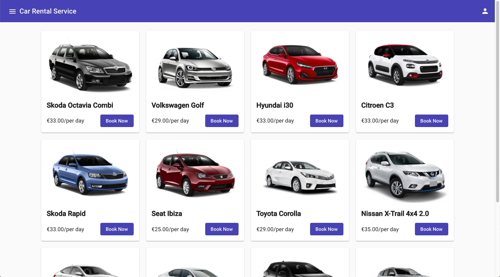
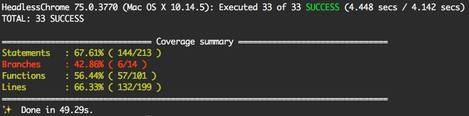

# Car Rental Service - https://fire-auth-8fd44.firebaseapp.com/home

## Technologies
1. [Angular](https://angular.io/) + Angular Cli
2. [Angular Material](https://material.angular.io) - layouts
3. [Firebase](https://firebase.google.com/) + [AngularFire](https://github.com/angular/angularfire2) - auth, firestore, hosting
4. Karma + Jasmine - testing
5. [Travis](https://travis-ci.org/) - auto testing and deploy

## Run locally
1. Be sure you have installed `node 10.16.0`
2. Install dependencies `yarn` or `npm install`
3. Run tests `yarn test` or `npm test`
4. Run development server `yarn start` or `npm start` - Navigate to `http://localhost:4200/`

## Project Architecture

All project are divided on modules and components:

- +auth - Authenticated module
    - sign-up - represent `auth/sign-up` page
    - sign-in - represent `auth/sign-in` page
    - shared/services - contains all necessary services for this module
        - auth-service - AuthService that call FireBaseAuth
- +home - Home page module
- +my-rental
    - my-rental-index - represent `/my-bookings` page
    - shares/services
        - my-rental - MyRentalService. Get/Return user bookings
- +rental
    - rental-index - represent `/rental` page
        - car-card - car component that display one car card on the page
    - shared/services
        - rental - RentalService. Browse through all available cars and Book a car of your choice
- framework - application wide classes/modules
    - core
        - base.component - BaseComponent abstract from which can be inherited.
        - shared.module - SharedModule exports modules which will be use on any other module
    - firebase/firebase.module - FireBaseModule - export necessary firebase modules
    - material - MaterialModule exports most common using material modules
- layout - contains base layout components:
    - footer
    - header
    - sidenav-menu
- shared - contains components, dto, services that will be using in any other module/component
    - components/confirm-booking-dialog
    - dto - (Data Transfer Objects) - interfaces that represent types for communications between Server and Client
    - services/token - TokenService - contains necessary methods for manipulations with jwt-token
- app.component - Base component of application
- app.module - Base module of application

## Code coverage

